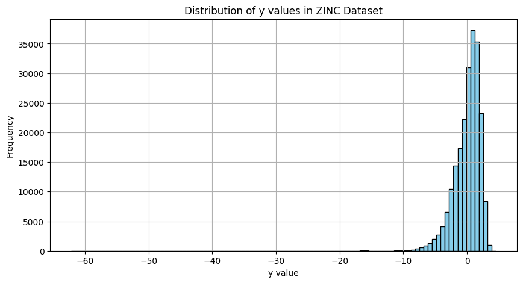
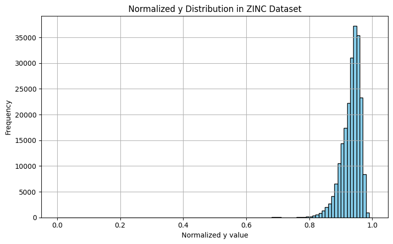
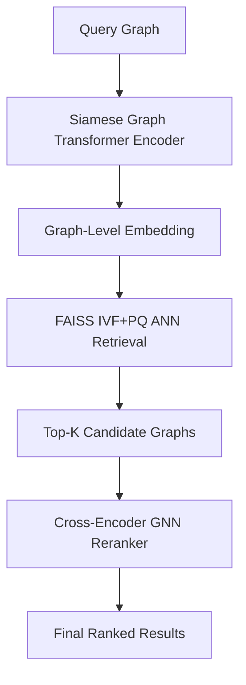

# **GraphSeeker**

### *Scalable Graph Retrieval with Siamese Graph Transformers and GNN-Based Reranking*


[](https://www.python.org/downloads/)
[](https://opensource.org/licenses/MIT)
[](https://pytorch.org/)
[](https://pytorch-geometric.readthedocs.io/)
[](https://pytorch-geometric.readthedocs.io/en/latest/modules/datasets.html#torch_geometric.datasets.ZINC)
[]()

---

**GraphSeeker** is a high-performance **graph retrieval framework** powered by **Siamese Graph Transformers** and a **two-stage reranking pipeline**. Designed with **scalability, interpretability**, and **search precision** in mind, it is ideal for use cases like **molecular similarity**, **semantic graph search**, and **graph clustering**.


## 🧪 Exploratory Data Analysis on ZINC

Before diving into contrastive training, we performed an in-depth analysis of the **ZINC dataset’s `y` values** (graph-level regression targets). This analysis was **crucial** in designing a **balanced sampling strategy** and choosing an optimal margin for positive and negative graph pairs.

---

### 🧼 Raw `y` Distribution (Unnormalized)

<div align="center">
  
</div>

* The `y` values are **highly concentrated** in the range \~\[1.5, 5.5], with a **long tail** on the lower side.
* Such skewed distributions **bias random sampling**, making it **unlikely** to form **semantically meaningful positive/negative pairs**.

---

### 🔁 Why Min-Max Normalization?

We considered two normalization strategies:

| Method            | Description                                                       | Outcome                                                                                         |
| ----------------- | ----------------------------------------------------------------- | ----------------------------------------------------------------------------------------------- |
| **Z-score (std)** | $y' = \frac{y - \mu}{\sigma}$                                     | Not effective: retained outliers and spread values beyond \[-3, 3], making delta tuning harder. |
| ✅ **Min-Max**     | $y' = \frac{y - y_{\text{min}}}{y_{\text{max}} - y_{\text{min}}}$ | Bounded in \[0, 1], helped make **distance thresholds interpretable and tunable**.              |

> 🔬 **Conclusion:** We adopted **min-max normalization** to ensure a **bounded**, **interpretable** and **contrast-friendly** space for similarity computation.

---

### 📊 Normalized `y` Distribution

<div align="center">
  
</div>

* Over **90% of graphs** lie in the tight band \[**0.85**, **0.97**] after normalization.
* We empirically chose `delta = 0.02` to create:

  * Sufficient **positive pairs** (`|y1 - y2| < delta`)
  * Reliable **negative pairs** (`|y1 - y2| ≥ delta`)

This normalization + delta selection dramatically **improved contrastive loss signal** and helped the model differentiate similar vs. dissimilar graphs much better.

## ✨ Core Highlights

### 🧠 **Siamese Graph Transformer Encoder**

* **Edge-Conditioned Attention**: Integrates edge features into attention for capturing rich **node–edge–subgraph** interactions.
* **Virtual Global Token**: Adds a learnable node to summarize **global context**, enabling **graph-size invariance**.
* **Contrastive Pairwise Training**: Learns fine-grained similarities via **NT-Xent loss**, tailored for **retrieval and ranking**.
* **Task-Agnostic Embeddings**: Generalizes well to **clustering**, **few-shot learning**, and **open-ended graph similarity** tasks.

---

## 🔍 Retrieval Pipeline

### 🚀 Stage 1: FAISS-Based ANN Search

* Uses **IVF (Inverted File Indexing)** and **PQ (Product Quantization)** to perform **sub-linear retrieval** over large corpora.
* Supports custom **speed/accuracy** tuning with `NLIST`, `NBITS`, and `NPROBE`.

### 🤖 Stage 2: Cross-Encoder GNN Reranker

* Builds a **joint supergraph** from query and candidates with **dynamic inter-graph edges**.
* Applies **message passing** and **global pooling** to refine similarity scores.
* Handles **distributional skew** with **balanced contrastive supervision**.

---

## 🧱 System Architecture



---

## 📁 Project Structure

```
Scalable_Graph_Retrieval/
  ├── Siamese-Graphormer/
  │   ├── train.py
  │   ├── model.py
  │   ├── loss.py
  │   ├── data/
  │   │   └── dataset.py
  │   ├── loss/
  │   │   └── loss.py
  │   └── network/
  │       ├── siamese.py
  │       ├── encoder.py
  │       └── edge_attention.py
  ├── Graph_Retriever/
  │   ├── get_similiar.py
  │   ├── train_re_ranker.py
  │   ├── config/
  │   │   └── config.yaml
  │   ├── embeddings/
  │   │   ├── check.ipynb
  │   │   └── graph_embeddings.pt
  │   └── network/
  │       ├── hybrid_retrieval.py
  │       └── re_ranker.py
  └── README.md
```

---

## ⚙️ Quickstart

### Step 1: Train the Siamese Graph Transformer

```bash
cd Siamese-Graphormer
python train.py
```

### Step 2: Run Hybrid Retrieval with Reranker

```bash
cd ../Graph_Retriever
python get_similiar.py
```

---

---

## 🧠 Dataset

* Training: [`ZINC`](https://pytorch-geometric.readthedocs.io/en/latest/modules/datasets.html#torch_geometric.datasets.ZINC)
* Contrastive targets: Graph-level regression values (`y`)
* Fully normalized for stability and better sampling

---

## 🤝 Contributions Welcome

We’re actively seeking improvements and collaborators!

Ideas for contribution:

* Add new **encoder variants** (e.g., GraphormerV2, SAN).
* Extend to **multi-query retrieval** or **zero-shot settings**.
* Benchmark on datasets like **ZINC**, **QM9**, or **ogbg-molpcba**.

---

## 📜 License

Licensed under the **MIT License**. See the `LICENSE` file for full terms.

