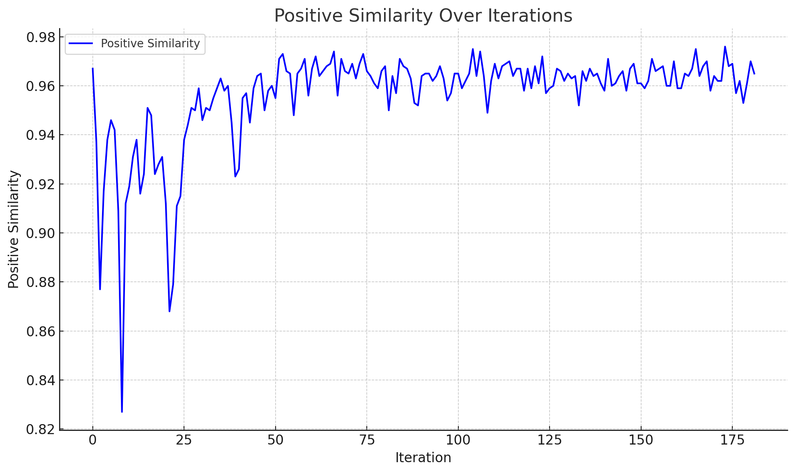

# **GraphSeeker**

### *Scalable Graph Retrieval with Siamese Graph Transformers and GNN-Based Reranking*

[](https://www.python.org/downloads/)
[](https://opensource.org/licenses/MIT)
[](https://pytorch.org/)
[](https://pytorch-geometric.readthedocs.io/)
[](https://pytorch-geometric.readthedocs.io/en/latest/modules/datasets.html#torch_geometric.datasets.ZINC)
[]()

---

**GraphSeeker** is a high-performance **graph retrieval framework** built on **Siamese Graph Transformers** and a **two-stage GNN-based reranking pipeline**. It is designed for applications in:

-  Molecular similarity
-  Semantic graph search
-  Graph clustering

with a focus on **scalability**, **generalizability**, and **robust contrastive learning**.

---

## 🧪 Contrastive Pretraining with Augmentations

We employ **in-batch contrastive learning** with the **NT-Xent loss**, inspired by SimCLR.

**Training Strategy:**

- Every graph `G` is paired with a stochastically augmented copy → `(G₁, G₂)`
- These form **positive pairs**; all others in the batch are treated as **negatives**
- Augmentations used:
  - **DropEdge** — Randomly removes edges
  - **FeatureMasking** — Masks node features

> This strategy eliminates the need for manual positive/negative sampling and supports out-of-the-box generalization across datasets.

---

## ✨ Model Overview

### 🧠 Siamese Graph Transformer Encoder

- **Edge-Conditioned Attention**: Injects edge features directly into the attention weights
- **Global Token**: Learnable node for graph-level representation
- **Augmentation-Aware Training**: Learns structure-invariant representations
- **Task-Agnostic Embeddings**: Suitable for retrieval, clustering, and few-shot tasks

---

## 🔍 Two-Stage Retrieval Pipeline

### 🚀 Stage 1: FAISS-Based ANN Retrieval

- **Fast approximate nearest neighbor** retrieval
- Based on **IVF+PQ indexing**
- Tunable parameters for accuracy-speed tradeoff: `NLIST`, `NBITS`, `NPROBE`

### 🤖 Stage 2: GNN-Based Reranker

- Constructs a **supergraph** from the query and retrieved candidates
- Uses a **cross-encoder GNN** for joint representation learning
- Trained with contrastive supervision (extendable to true relevance labels)

---

## 🧱 System Architecture

```mermaid
graph TD
    A[Query Graph] --> B[Siamese Graph Transformer Encoder]
    B --> C[Graph-Level Embedding]
    C --> D[FAISS IVF+PQ ANN Retrieval]
    D --> E[Top-K Candidate Graphs]
    E --> F[Cross-Encoder GNN Reranker]
    F --> G[Final Ranked Results]
````

---

## 📉 Training Loss Curve

<p align="center">
  
</p>

The NT-Xent loss **steadily decreases**, indicating stable convergence during contrastive pretraining.

---

## 📈 Positive Similarity Curve

<p align="center">
  
</p>

The average cosine similarity between positive graph pairs **increased consistently during training**, eventually reaching a value of **0.96**, indicating highly aligned latent embeddings for augmented versions of the same graph.

---

## 📁 Project Structure

```
GraphSeeker/
├── Siamese-Graphormer/
│   ├── train.py
│   ├── model.py
│   ├── data/
│   │   └── dataset.py
│   ├── loss/
│   │   └── loss.py
│   └── network/
│       ├── siamese.py
│       ├── encoder.py
│       └── edge_attention.py
├── Graph_Retriever/
│   ├── get_similiar.py
│   ├── train_re_ranker.py
│   ├── config/
│   │   └── config.yaml
│   ├── embeddings/
│   │   ├── check.ipynb
│   │   └── graph_embeddings.pt
│   └── network/
│       ├── hybrid_retrieval.py
│       └── re_ranker.py
└── assets/
    ├── loss_curve.png
    └── pos_sim_curve.png
```

---

## ⚙️ Quickstart

### 1️⃣ Pretrain the Siamese Graph Transformer

```bash
cd Siamese-Graphormer
python train.py
```

* Uses **in-batch NT-Xent loss**
* Applies **DropEdge** and **FeatureMasking**
* Saves embeddings to `embeddings/train_graph_embeddings.npy`
* Automatically uses **GPU if available**

### 2️⃣ Run Hybrid Retrieval

```bash
cd ../Graph_Retriever
python get_similiar.py
```

* Retrieves top-k candidates via FAISS
* Reranks them using the GNN cross-encoder

---

## 📊 Dataset: ZINC

* Provided by **PyTorch Geometric**
* Each graph represents a molecule with:

  * Node features: atom types
  * Edge features: bond types
* Augmentations are applied **on-the-fly** during training

---

## 📈 Training Logs

We log the following metrics:

* 📉 NT-Xent **contrastive loss**
* 📈 Average **positive similarity** (final value: **0.96**)

For deeper monitoring, integrate with **TensorBoard** or **Weights & Biases**.

---

## 🤝 Contributions Welcome

We're actively expanding this framework!

### Ideas for contribution:

* 📦 Add support for **larger molecular datasets**
* ⚡ Speed up reranking with lightweight GNNs
* 🔁 Add **text-conditioned graph retrieval**
* 📊 Benchmark on **OGBG**, **QM9**, **PCQM4M**, etc.

---

## 📜 License

Distributed under the **MIT License**. See `LICENSE` for details.

