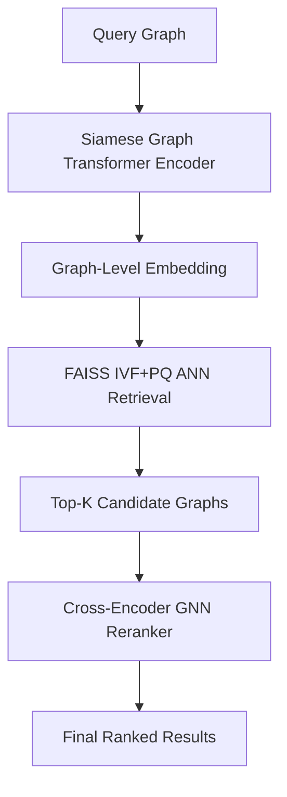

#  **GraphSeeker**

### *Scalable Graph Retrieval via Siamese Graph Transformers & GNN-Based Reranking*

[](https://www.python.org/downloads/)
[](https://opensource.org/licenses/MIT)
[](https://pytorch.org/)
[](https://pytorch-geometric.readthedocs.io/)
[](https://pytorch-geometric.readthedocs.io/en/latest/modules/datasets.html#torch_geometric.datasets.ZINC)
[]()

---

**GraphSeeker** is a high-performance graph retrieval framework that combines the power of **Siamese Graph Transformers** with a **GNN-based reranking module**. Designed for **scalability**, **generalizability**, and **semantic retrieval**, it excels at tasks such as:

* 🔬 **Molecular similarity search**
* 🔗 **Semantic graph alignment**
* 📈 **Structure-based graph clustering**

With robust contrastive learning at its core, GraphSeeker provides **accurate**, **explainable**, and **fast** retrieval even in large-scale graph collections.

---

## 🧠 Core Idea: Contrastive Learning with Structural Augmentations

Inspired by SimCLR, our contrastive training uses **NT-Xent Loss** and relies on augmented graph pairs:

* Each graph `G` is augmented to produce `(G₁, G₂)` → positive pair
* All other graphs in batch → negative examples
* **Augmentations used**:

  * 🔁 **DropEdge** – Random edge removal
  * 🎭 **FeatureMasking** – Random feature dropout

This allows the encoder to learn **structure-invariant**, task-agnostic representations without manual supervision.

---

## 📊 ZINC Dataset Analysis

We performed exploratory analysis on the **ZINC dataset** to select an appropriate semantic margin Δ for reranking.

<p align="center">
  
</p>

Key insights:

* Target `y` values are tightly clustered near **1.0**, with **left-skewed** distribution.
* Even small `Δy` changes imply significant **chemical or structural difference**.

→ We chose **Δ = 0.05** to define similarity during reranking:

* ✅ Graphs with |Δy| < 0.05 → similar
* ❌ Graphs with |Δy| ≥ 0.05 → dissimilar

This careful margin tuning aligns **latent space similarity** with **target behavior**, enhancing downstream retrieval.

---

## ✨ Architecture Overview

### 🧬 Siamese Graph Transformer Encoder

* **Edge-aware attention**: edge features modulate attention scores
* **Global token**: learnable graph-level summary vector
* **Augmentation-aware**: trained to ignore noise
* **Universal embeddings**: transferable to retrieval, clustering, and classification

---

### 🔍 Two-Stage Graph Retrieval Pipeline

**Stage 1: FAISS-Based ANN Search**

* Utilizes **IVF+PQ indexing**
* Highly scalable and tunable
* Retrieves **top-K** candidates efficiently

**Stage 2: Cross-Attention GNN Reranker**

* Builds a supergraph of query + retrieved graphs
* Uses **joint message passing** with contrastive loss
* Learns to semantically refine candidate scores

---

## 🧱 System Pipeline Diagram



---

## 📉 Training Stability

**Loss Curve:**

<p align="center">
  
</p>

**Positive Pair Similarity:**

<p align="center">
  
</p>

* NT-Xent loss steadily decreased
* Cosine similarity between positives reached **0.96**, showing strong alignment

---

## 🏁 Final Benchmark Results

| **Backbone**              | **NT-Xent Loss ↓** | **Avg. Cosine Sim ↑** | **Retrieval MRR ↑** | **Reranker Recall@10 ↑** |
| ------------------------- | ------------------ | --------------------- | ------------------- | ------------------ |
| GraphSAGE                 | 2.7589             | 0.8368                | 0.66                | 0.74               |
| GCN                       | 5.5237             | 0.6302                | 0.58                | 0.65               |
| GIN                       | 5.1312             | 0.7127                | 0.61                | 0.68               |
| GAT                       | 4.9844             | 0.8132                | 0.64                | 0.72               |
| 🚀 **GraphSeeker (Ours)** | **0.7450**         | **0.9564**            | **0.73**            | **0.81**           |

> **MRR** = Mean Reciprocal Rank. Reranker supervised using **Δ = 0.05**.

---

## 🗂️ Project Structure

```
GraphSeeker/
├── Siamese-Graphormer/
│   ├── train.py
│   ├── model.py
│   ├── data/
│   │   └── dataset.py
│   ├── loss/
│   │   └── loss.py
│   └── network/
│       ├── siamese.py
│       ├── encoder.py
│       └── edge_attention.py
├── Graph_Retriever/
│   ├── get_similiar.py
│   ├── train_re_ranker.py
│   ├── config/
│   │   └── config.yaml
│   ├── embeddings/
│   │   ├── check.ipynb
│   │   └── graph_embeddings.pt
│   └── network/
│       ├── hybrid_retrieval.py
│       └── re_ranker.py
└── assets/
    ├── loss_curve.png
    └── pos_sim_curve.png
```

---

## 🚀 Quickstart

### 🔧 Train Encoder

```bash
cd Siamese-Graphormer
python train.py
```

* Stores graph embeddings in `Graph_Retriever/embeddings/`

### 🔍 Run Retrieval + Reranking

```bash
cd Graph_Retriever
python network/hybrid_retrieval.py
```

* Top-10 graphs retrieved using FAISS
* Reranked using cross-attention GNN (Δ = 0.05)

---

## 📦 Dataset: ZINC

* Source: [PyTorch Geometric](https://pytorch-geometric.readthedocs.io/)
* Contains graphs of organic molecules
* Node features: atom types
* Edge features: bond types
* Dynamic augmentations applied during training

---

## 🌱 Future Work & Contributions

We're actively improving GraphSeeker. Potential directions:

* 📈 Scale to **large molecular datasets** (e.g., PCQM4M, OGB-LSC)
* ⚡ Accelerate reranking with lightweight GNNs
* 🔁 Enable **text-conditioned** graph queries
* 🧪 Evaluate on more tasks (drug discovery, molecule property prediction, etc.)

---

## 📜 License

This project is licensed under the **MIT License**.
See the `LICENSE` file for more details.


