#  **GraphSeeker**

### *Scalable Graph Retrieval with Siamese Graph Transformers and GNN-Based Reranking*

[](https://www.python.org/downloads/)
[](https://opensource.org/licenses/MIT)
[](https://pytorch.org/)
[](https://pytorch-geometric.readthedocs.io/)
[](https://ogb.stanford.edu/docs/graphprop/)
[]()

---

**GraphSeeker** is a cutting-edge graph retrieval system designed for **scalability** and **precision**. It combines a **Siamese Graph Transformer encoder** with a **two-stage retrieval pipeline**, delivering unparalleled performance on graph-based tasks.

---

## ✨ Key Features

### 💡 **Siamese Graph Transformer Encoder**
- **Edge-Conditioned Attention:** Seamlessly integrates edge attributes into the attention mechanism, capturing **node–edge–subgraph** interactions.
- **Virtual Node for Global Context:** Adds a learnable **virtual token** to represent global structure in a **size-invariant** format.
- **Pairwise Contrastive Training:** Trained with **contrastive loss**, ideal for **retrieval**, **matching**, and **clustering** tasks.
- **Task-Agnostic Embeddings:** Transferable to a wide array of downstream tasks like **few-shot classification** and **unsupervised clustering**.

---

### 🔍 **Graph Retrieval Pipeline**

#### 🧠 FAISS-Based Approximate Nearest Neighbor Search
- Efficiently scales to **tens of thousands** of graph embeddings.
- Utilizes `IVF` (Inverted File Indexing) and `PQ` (Product Quantization) for **fast, memory-efficient** similarity searches.
- Customizable **speed/recall trade-offs** with parameters like `NLIST`, `NBITS`, and `NPROBE`.

#### 🤖 Cross-Encoder GNN Reranker
- **Reranks top-K candidates** by merging query and candidates into a **joint graph**.
- Exploits **message passing** and **graph pooling** for refined scoring.
- Designed to address dataset imbalance via **balanced supervision**.

#### ⚡ Dynamic Joint Graph Construction
- Dynamically merges graphs during inference with **inter-graph edges**.
- Captures **fine-grained structural similarities** for enhanced reranking precision.

---

## 🛠️ Architecture Overview

```mermaid
graph TD
    A[Query Graph] --> B[Siamese Graph Transformer Encoder]
    B --> C[Graph-Level Embedding]
    C --> D[FAISS IVF+PQ ANN Retrieval]
    D --> E[Top-K Candidate Graphs]
    E --> F[Cross-Encoder GNN Reranker]
    F --> G[Final Ranked Results]
```



---

## 📂 Project Structure

```
Scalable_Graph_Retrieval/
  ├── Siamese-Graphormer/
  │   ├── generate_embeddings.py
  │   ├── loss.py
  │   ├── model.py
  │   ├── train.py
  │   ├── data/
  │   │   └── dataset.py
  │   ├── loss/
  │   │   └── loss.py
  │   └── network/
  │       ├── edge_attention.py
  │       ├── encoder.py
  │       └── siamese.py
  ├── Graph_Retriever/
  │   ├── get_similiar.py
  │   ├── train_re_ranker.py
  │   ├── config/
  │   │   └── config.yaml
  │   ├── embeddings/
  │   │   ├── check.ipynb
  │   │   └── graph_embeddings.pt
  │   └── network/
  │       ├── hybrid_retrieval.py
  │       └── re_ranker.py
  └── README.md
```

---

## ⚡ Quickstart

Follow these steps to get started with **GraphSeeker**:

1. **Train the Siamese Graph Transformer and generate graph embeddings:**

   ```bash
   python train.py
   ```

2. **Build the FAISS index and perform hybrid retrieval with GNN-based reranking:**

   ```bash
   python Graph_Retriever/get_similiar.py
   ```

---

## 📊 Dataset

- Leverages the **OGB-MolHIV** benchmark for supervised training.
- Easily adaptable to any graph classification dataset with **graph-level labels**.

---

## 🤝 Contributing

We welcome contributions! 🎉

Feel free to open issues or submit PRs to:
- Extend **GraphSeeker** to new graph domains.
- Add benchmarks or implement novel retrieval strategies.

---

## 📄 License

Distributed under the **MIT License**. See `LICENSE` for more information.

---
