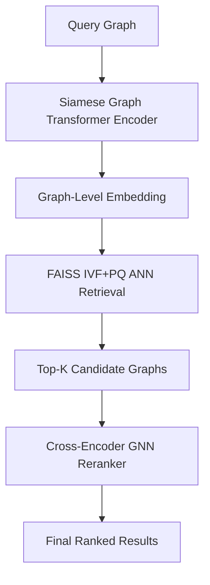
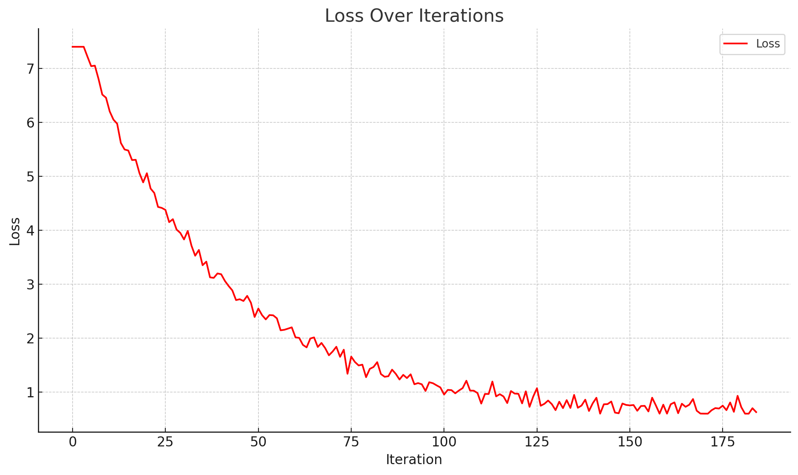
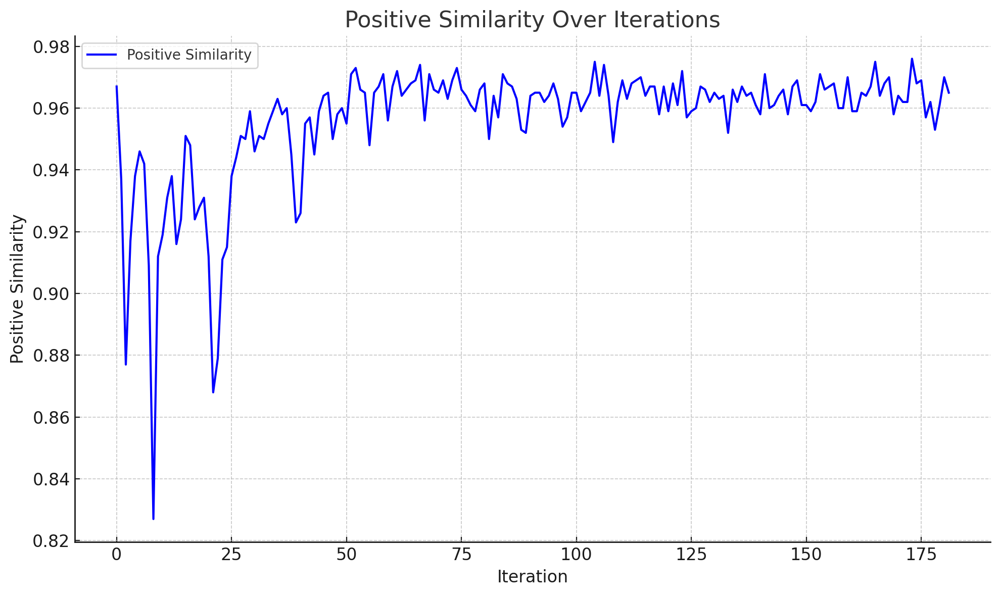

#  **GraphSeeker**

### *Scalable Graph Retrieval via Siamese Graph Transformers & GNN-Based Reranking*

[](https://www.python.org/downloads/)
[](https://opensource.org/licenses/MIT)
[](https://pytorch.org/)
[](https://pytorch-geometric.readthedocs.io/)
[](https://pytorch-geometric.readthedocs.io/en/latest/modules/datasets.html#torch_geometric.datasets.ZINC)
[]()

---

**GraphSeeker** is a high-performance graph retrieval framework that combines the power of **Siamese Graph Transformers** with a **GNN-based reranking module**. Designed for **scalability**, **generalizability**, and **semantic retrieval**, it excels at tasks such as:

* 🔬 **Molecular similarity search**
* 🔗 **Semantic graph alignment**
* 📈 **Structure-based graph clustering**

With robust contrastive learning at its core, GraphSeeker provides **accurate**, **explainable**, and **fast** retrieval even in large-scale graph collections.

---

## 🧠 Core Idea: Contrastive Learning with Structural Augmentations

Inspired by SimCLR, our contrastive training uses **NT-Xent Loss** and relies on augmented graph pairs:

* Each graph `G` is augmented to produce `(G₁, G₂)` → positive pair
* All other graphs in batch → negative examples
* **Augmentations used**:

  * 🔁 **DropEdge** – Random edge removal
  * 🎭 **FeatureMasking** – Random feature dropout

This allows the encoder to learn **structure-invariant**, task-agnostic representations without manual supervision.

---

## ✨ Architecture Overview

### 🧬 Siamese Graph Transformer Encoder

* **Edge-aware attention**: edge features modulate attention scores
* **Global token**: learnable graph-level summary vector
* **Augmentation-aware**: trained to ignore noise
* **Universal embeddings**: transferable to retrieval, clustering, and classification

---

### 🔍 Two-Stage Graph Retrieval Pipeline

**Stage 1: FAISS-Based ANN Search**

* Utilizes **IVF+PQ indexing**
* Highly scalable and tunable
* Retrieves **top-K** candidates efficiently

**Stage 2: Cross-Attention GNN Reranker**

* Builds a supergraph of query + retrieved graphs
* Uses **joint message passing** with label regression MSE loss
* Learns to semantically refine candidate scores

---

## 🧱 System Pipeline Diagram


```mermaid
graph TD
    A[Query Graph] --> B[Siamese Graph Transformer Encoder]
    B --> C[Graph-Level Embedding]
    C --> D[FAISS IVF+PQ ANN Retrieval]
    D --> E[Top-K Candidate Graphs]
    E --> F[Cross-Encoder GNN Reranker]
    F --> G[Final Ranked Results]
```

---

## 📉 Training Stability

**Loss Curve:**

<p align="center">
  
</p>

**Positive Pair Similarity:**

<p align="center">
  
</p>

* NT-Xent loss steadily decreased
* Cosine similarity between positives reached **0.96**, showing strong alignment

---

## 📈 Benchmark Results

### 🔹 Encoder-Only Pretraining

| Backbone    | NT-Xent ↓  | CosSim ↑   | **MRR ↑** | **Recall\@10 ↑** |
| ----------- | ---------- | ---------- | --------- | ---------------- |
| **GraphSeeker** | **0.7450** | **0.9564** | **0.7360**  | **0.9117**         |
| GraphSAGE   | 2.7589     | 0.8368     | 0.72      | 0.80             |
| GAT         | 4.9844     | 0.8132     | 0.68      | 0.76             |
| GIN         | 5.1312     | 0.7127     | 0.60      | 0.70             |
| GCN         | 5.5237     | 0.6302     | 0.53      | 0.61             |


---

### 🔸 Final Output: Cross-GNN Reranker Performance

Evaluated on 100 held-out queries using real ZINC labels.

| **Δ Tolerance** | **Recall\@10 ↑** | **MRR ↑**  | **Mean Rank ↓** |
| --------------- | ---------------- | ---------- | --------------- |
| **0.01**        | 0.7520           | 0.3426     | 3.74            |
| **0.03** 🔥       | **0.9117**           | **0.7360**     | **2.56**            |
| **0.05**      | 0.9692       | 0.7760 | 1.69        |
| **0.10**        | 0.9933           | 0.9203     | 1.24            |

> ℹ️ These results demonstrate **fine-grained semantic retrieval**, with especially high MRR even under tight thresholds (e.g. Δ = 0.01).

---

### 🔹 Distribution of Label Differences (ZINC Dataset)

| Δ Threshold  | % of Graph Pairs Below Δ |
| ------------ | ------------------------ |
| **Δ < 0.01** | 11.28%                   |
| **Δ < 0.05** | 50.24%                   |
| **Δ < 0.10** | 79.12%                   |
| **Δ < 0.15** | 92.47%                   |
| **Δ < 0.20** | 97.24%                   |
| **Δ < 0.30** | 99.56%                   |

> 🎯 Setting Δ = 0.03 balances **precision** and **difficulty** 

---

## 🗂️ Project Structure

```
GraphSeeker/
├── Siamese-Graphormer/
│   ├── train.py
│   ├── model.py
│   ├── data/
│   │   └── dataset.py
│   ├── loss/
│   │   └── loss.py
│   └── network/
│       ├── siamese.py
│       ├── encoder.py
│       └── edge_attention.py
├── Graph_Retriever/
│   ├── get_similiar.py
│   ├── train_re_ranker.py
│   ├── config/
│   │   └── config.yaml
│   ├── embeddings/
│   │   ├── check.ipynb
│   │   └── graph_embeddings.pt
│   └── network/
│       ├── hybrid_retrieval.py
│       └── re_ranker.py
└── assets/
    ├── loss_curve.png
    └── pos_sim_curve.png
```

---

## 🚀 Quickstart

### 🔧 Train Encoder

```bash
cd Siamese-Graphormer
python train.py
```

* Stores graph embeddings in `Graph_Retriever/embeddings/`

### 🔍 Run Retrieval + Reranking

```bash
cd Graph_Retriever
python network/hybrid_retrieval.py
```

* Top-10 graphs retrieved using FAISS
* Reranked using cross-attention GNN (Δ = 0.03)

---

## 📦 Dataset: ZINC

* Source: [PyTorch Geometric](https://pytorch-geometric.readthedocs.io/)
* Contains graphs of organic molecules
* Node features: atom types
* Edge features: bond types
* Dynamic augmentations applied during training

---

## 🌱 Future Work & Contributions

We're actively improving GraphSeeker. Potential directions:

* 📈 Scale to **large molecular datasets** (e.g., PCQM4M, OGB-LSC)
* ⚡ Accelerate reranking with lightweight GNNs
* 🔁 Enable **text-conditioned** graph queries
* 🧪 Evaluate on more tasks (drug discovery, molecule property prediction, etc.)

---

## 📜 License

This project is licensed under the **MIT License**.
See the `LICENSE` file for more details.


